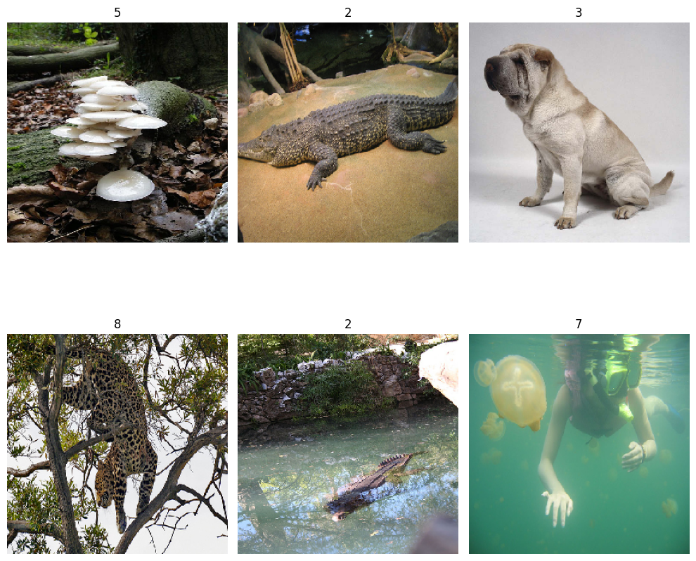
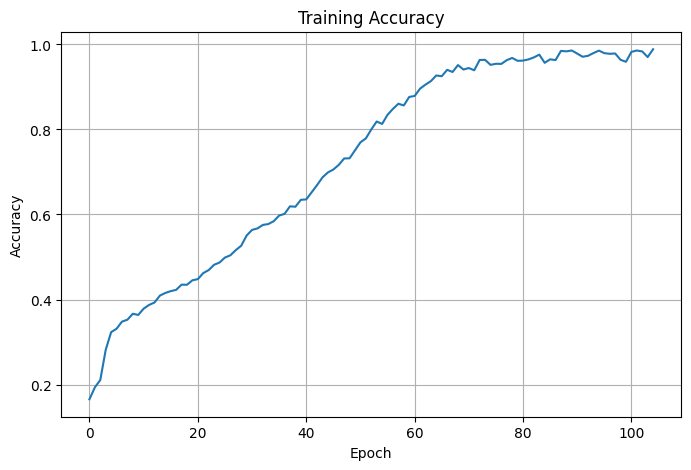
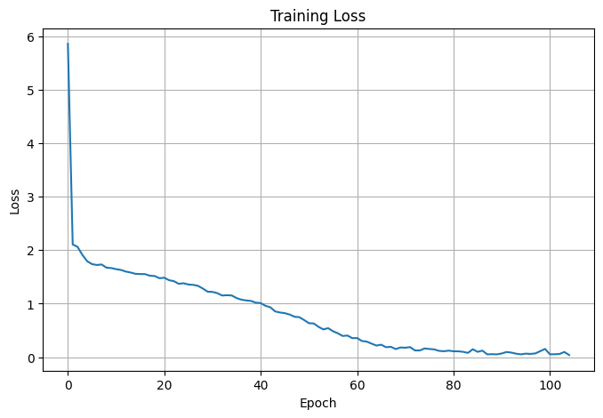
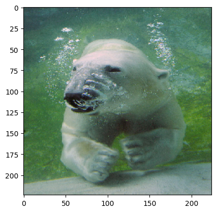

# Image Object Recognition using AlexNet

A Convolutional Neural Network project that implements the classic **AlexNet** architecture from scratch (using TensorFlow/Keras) to classify images from a 10-class subset of ImageNet, and compares it against a pretrained **ResNet50** for prediction.

---


## 📌 Project Overview

This project builds and trains an AlexNet-style CNN for image classification, then demonstrates inference using a pretrained ImageNet model (ResNet50) on a sample test image.

- **Dataset**: A small ImageNet subset — *[ImageNetSmall](https://www.kaggle.com/datasets/shukdevdatta/imagenetsmall)* (hosted on Kaggle)
  - **4,000 training images** across **10 classes**
  - Images organized in `training_set/<class_name>/...` folder structure (compatible with Keras `flow_from_directory`)
- **Preprocessing**:
  - Images rescaled/normalized (`1./255`)
  - Resized to **277×277×3** for the AlexNet input
  - Loaded in batches via `ImageDataGenerator` with `class_mode='categorical'`
- **Model architecture (custom AlexNet)**:
  | Layer | Details |
  |---|---|
  | Conv Block 1 | Conv2D(96, 11×11, stride 4) → BatchNorm → ReLU → MaxPool(3×3, stride 2) |
  | Conv Block 2 | Conv2D(256, 5×5, same) → BatchNorm → ReLU → MaxPool(3×3, stride 2) |
  | Conv Block 3 | Conv2D(384, 3×3, same) → BatchNorm → ReLU |
  | Conv Block 4 | Conv2D(384, 3×3, same) → BatchNorm → ReLU |
  | Conv Block 5 | Conv2D(256, 3×3, same) → BatchNorm → ReLU → MaxPool(3×3, stride 2) |
  | Fully Connected | Flatten → Dense(4096, ReLU) → Dense(4096, ReLU) → Dense(10, Softmax) |
- **Training approach**:
  - Optimizer: `adam`
  - Loss: `categorical_crossentropy`
  - Metric: `accuracy`
  - Trained for **105 epochs** on the full training set (no held-out validation split in this run)
  - `EarlyStopping` callback configured (`monitor='val_loss'`, `patience=10`)
  - Final training accuracy reached **~98.9%** with loss **~0.04**
- **Prediction demo**: A held-out test image (a bear) is classified using a pretrained **ResNet50** (ImageNet weights) to show top-3 predicted classes with confidence scores.

---

## ⚙️ Setup Instructions

### 1. Requirements

- Python 3.8+
- Jupyter Notebook / JupyterLab (or Kaggle / Google Colab)

### 2. Install dependencies

```bash
pip install tensorflow numpy matplotlib
```

> This project was developed and run on **Kaggle**, so file paths in the notebook (e.g. `/kaggle/input/...`) point to a Kaggle dataset mount. If you're running locally or on Colab, update these paths to wherever you download/extract the dataset.

### 3. Get the dataset

Download the dataset from Kaggle:
👉 [ImageNetSmall](https://www.kaggle.com/datasets/shukdevdatta/imagenetsmall)

Then update the dataset path in the notebook:

```python
path = '<your-local-path>/training_set'
```

### 4. Run the notebook

```bash
git clone https://github.com/Md-JahedulAlam/Image-Object-Recognition-using-AlexNet.git
cd Image-Object-Recognition-using-AlexNet
jupyter notebook image-object-recognition.ipynb
```

Run all cells in order:
1. Load & preprocess the dataset
2. Visualize sample images
3. Build the AlexNet model
4. Train the model (105 epochs)
5. Plot accuracy/loss curves
6. Run prediction on a test image

---

## 🖼️ Output Preview

**Sample training images**



**Training accuracy & loss curves**

| Accuracy | Loss |
|---|---|
|  |  |

**Prediction on a test image**



Top-3 predictions (via pretrained ResNet50):

```
1. ice_bear         98.5%
2. dugong            1.0%
3. hippopotamus      0.2%
```

---

## 📂 Repository Structure

```
Image-Object-Recognition-using-AlexNet/
├── image-object-recognition.ipynb   # Main notebook (data prep, model, training, prediction)
├── images/                          # Preview images used in this README
└── README.md
```

---

## 📝 Notes / Known Limitations

- Training is done without a validation split, so the configured `EarlyStopping(monitor='val_loss')` callback has no effect in this run.
- The final prediction step uses a pretrained **ResNet50** rather than the custom-trained AlexNet model — this is meant as an inference demo, not an evaluation of the trained AlexNet.
